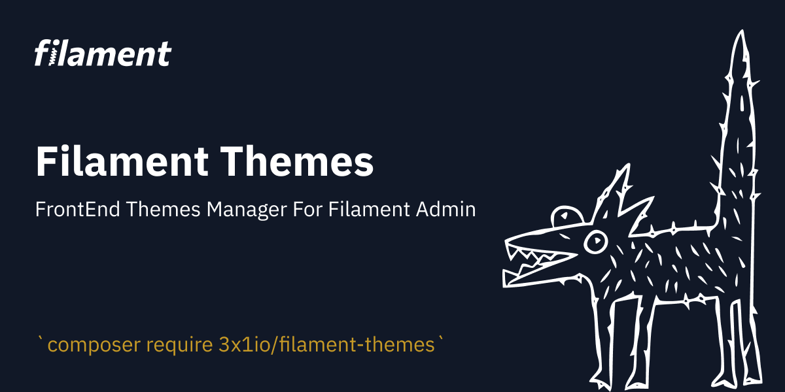

# Filament Theme Manager

FrontEnd Themes Manager For Filament Admin

## Installation

You can install the package via composer:

```bash
composer require 3x1io/filament-themes
```

Run migration:

```bash
php artisan vendor:publish --provider="Spatie\LaravelSettings\LaravelSettingsServiceProvider" --tag="migrations"
php artisan vendor:publish --tag="filament-themes-assets"
php artisan vendor:publish --tag="filament-themes-migrations"
```

Run migration:

```bash
php artisan migrate
```

Remove default route from routes/web.php

```bash
php artisan optimize
```

add to your composer.json

```json
"autoload": {
    "psr-4": {
        "App\\": "app/",
        "Database\\Factories\\": "database/factories/",
        "Database\\Seeders\\": "database/seeders/",
        "Themes\\": "resources/views/themes/"
    }
},
```

```bash
composer dump-autoload
```

## Create New Theme

to create a new theme just this this command

```bash
php artisan filament-themes:generate
```

it will ask you for the theme name and the theme description

and you will get your new theme folder on path `resources/views/themes/THEME_NAME`

and your assets folder on path `public/themes/THEME_NAME`

<hr>

## Theme Helpers

our theme feature has some helpers to make it easy to make a frontend theme like theme assets url

```php
theme_assets()
```

this function take a `url` and make it easy to access your theme path `public/themes/THEME_NAME/`

```php
theme_namespace()
```

this function get the namespace for the controller folder of the current theme

```php
show_menu()
```

this function take a `key` and get this key from `settings` table and decode it to array so you can use it when you make a menu inside a json setting.

```php
dollar()
```

this function take a `number` and convert it to money style with a currency symbol

<hr>

## Generate a Theme Controller

our themes feature support artisan command to generate a new theme controller you can use this command like

```bash
php artisan filament-themes:controller
```

i will ask you about Theme Name and Controller Name

**Note:** the controller name must be in `PascalCase` without `Controller` word on the end because we attach it automatically

## Changelog

Please see [CHANGELOG](CHANGELOG.md) for more information on what has changed recently.

## Credits

- [Fady Mondy](https://github.com/3x1io)

## License

The MIT License (MIT). Please see [License File](LICENSE.md) for more information.
